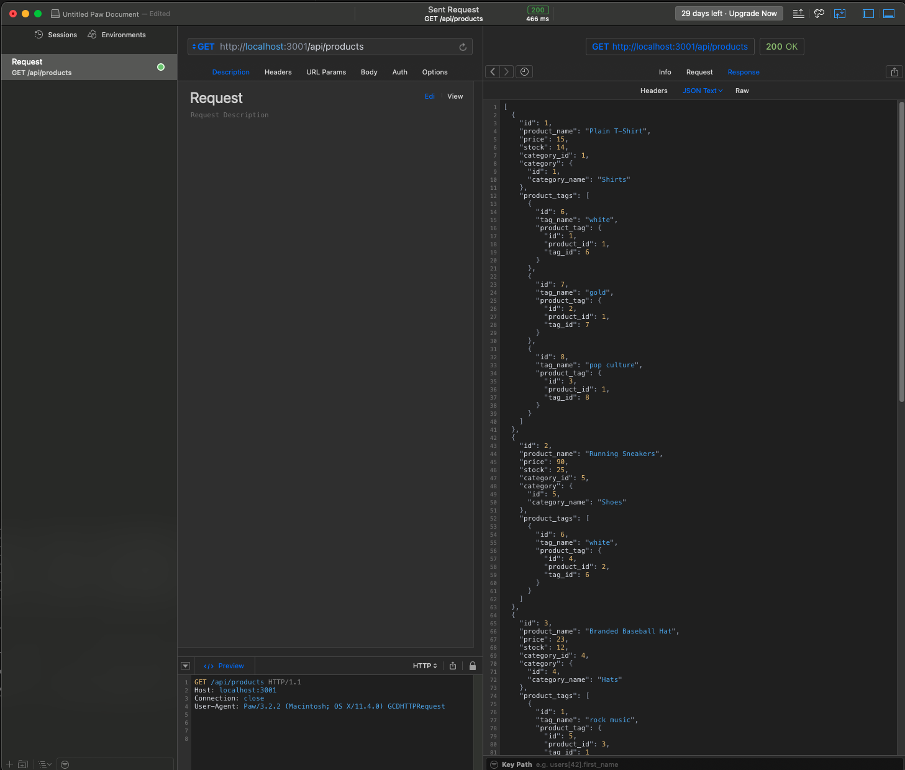

# 13 Object-Relational Mapping (ORM)

## Creating an E-Commerce Back End

This is the thirteenth assignment for the MSU Coding Bootcamp; To build the back end  for an e-commerce site by configuring a working Espress.js API to use Sequelize to interact with a MySQL database.

### Live Links
- [Daniel Shoup's E-Commerce Back End Repisitory](https://github.com/danshoup/e-commerce-backend)
- [Daniel Shoup's E-Commerce Back End Demo Video Part 1: VS Code](https://drive.google.com/file/d/15kASBcyVaj1ULiDYopa0ufxYTQJPUo1f/view)
- [Daniel Shoup's E-Commerce Back End Demo Video Part 2: Insomnia Route Tests](https://drive.google.com/file/d/1CWhmNc7IDB9744oKr5sk8264juaU3Frv/view)

### E-Commerce Back End Screenshot

## Acceptance Criteria

- The application will use node, inquirer, and MySQL.

- Database schema contains the following three tables: employee - id, first_name, last-name, role_id, manager_id; role - id, title, salary, department_id; department - id, name.

- ID is the primary key on all tables. department_id, role_id, and manager_id are FOREIGN KEYS.

- Command-line application allows user to add departments, roles, and employees.

- Command-line application allows user to view departments, roles, and employees.

- Command-line application allows user to update employee roles.

- GitHub URL must be submitted, and the repository must contain the application code.

- Application console is free of errors.

- Repository has a unique name and follows best practices for naming, indentation, comments, and contains descriptive commit messages.  The repository also contains a quality READMY file with description, screenshot,a nd link to deployed application.

- BONUS: Application allows users update employee manager, vew employees by manager, delete departments, roles, and employees, and view total budget of a department.

- URL of the GitHub repository, and a linkd to a demmo video of the application must be submitted.

